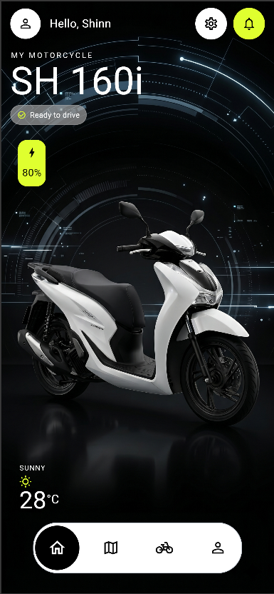

# mysh160i

Flutter app for Honda SH160i: home UI, clean architecture with Cubit, and frame-based 360 view.

## Preview



## Run


```bash
flutter pub get
flutter run
```

## Project

- Package name in code: `mymotorcycle` (from `pubspec.yaml`).
- Remote repo: [QuillVi/mysh160i](https://github.com/QuillVi/mysh160i).

For Flutter help, see [Flutter documentation](https://docs.flutter.dev/).
